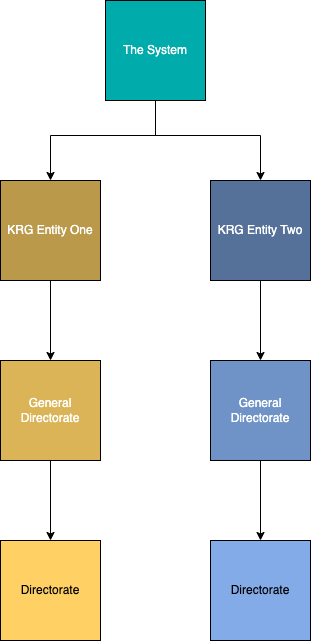
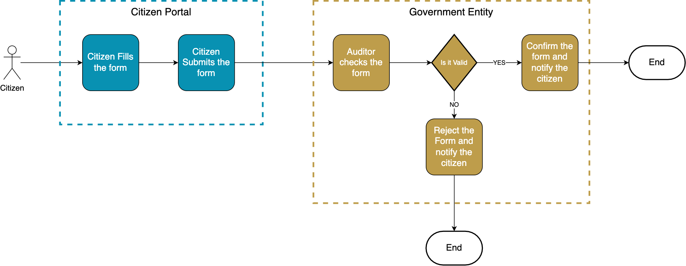

# Documentation Guidelines

## Introduction

Documenting the system requirements is really important in the discovery phase for understanding what the service is, why it exists, and how it can be improved. It will have a lot of impact in the development phase, the development team can understand the system really quickly and build it in less errors. Use this [template](https://docs.google.com/document/u/0/d/1FZqdr-2xK0YuyiWsdvuDQHNCscFL4xJHDe9ueMUP_Us/edit) for documenting the requirements according to the guidelines in this page.

## Mind mapping guideline

The mind map diagram is for showing all the stakeholders in hierarchical representation. This diagram is useful for understanding the role and responsibilities of the stakeholders, and getting an overview of how the business structure is.

### How to draw a mind map diagram?

-   Write down all the stakeholders in a square shape like this:  
    

-   All the stakeholders should be connected in a hierarchical way.

-   The square that are in different stages within the diagram should be colored appropriately like the example below:  
    

-   In each stage the colors should get lighter as it goes down the hierarchy like the example below:  
    

## Functional requirements

Functional requirements define the system's behavior. It can be a business process, a user's need, or a calculation of some data. These requirements later on will be embedded in the system.

### How to write functional requirements? {#How-to-write-functional-requirements}

The functional requirement should be written in the following table format:

|ID|Requirement|Priority|
|---|-----|-----|
|#[ID]|[Description of the requirement]|[Use [MoSCoW technique](#moscow-techniques)]|
|#[ID]|[Description of the requirement]|[Use [MoSCoW technique](#moscow-techniques)]|

Example:  

|ID|Requirement|Priority|
|---|-----|-----|
|#1|Citizens must fill out a request form|Must have|
|#2|Citizens can check the form status|Should have|

## Non-functional requirements

Non-functional requirements define the quality of the system like scalability, responsiveness, serviceability, and reliability.

### How to write non-functional requirements?

The non-functional requirement should be written in the same format as [Functional Requirements](#How-to-write-functional-requirements).

Example:

|ID|Requirement|Priority|
|---|-----|-----|
|#1|User should get back results of the search in under 5 seconds|Should have|
|#2|User should authenticate in a secure method like 2FA|Could have|

## Transition requirements

Any requirements that are needed for replacing the current system with the proposed system should be indicated. The requirements need to be written in a numbered list.

For example:

1.  Two computers are needed for using the system.

2.  All the data in the old system needs to be transferred to the proposed system.

3.  [The rest of the requirements]

## Flowchart diagram guideline

The flowchart diagram is great for understanding the workflow of the system, from where and how it starts until where and how it ends. It is an introduction to how the system works. Therefore, it is necessary for the flowchart to be clear, concise, and cover every aspect of the system.

### How to draw the flowchart diagram?

-   Use [standard UML](https://www.edrawsoft.com/flowchart-symbols.html) shapes for expressing the steps of the workflow.

-   If the workflow starts with a human interaction, the flowchart should start with a stickman shape.  
    

-   If there are multiple stages for the workflow or different entities involved. The workflow between the stages/entities should be separated by boxes and colors like the example below.  
    

## User stories guideline

Users are the center of the system, knowing what they need and why they need it will help you build the system in the right way. Therefore, user stories can be helpful in understanding the service that the system provides to its stakeholders.

### How to write the user stories?

It is important for the user stories to be clear and easy to understand, to achieve that follow the format shown below.

|User Story #[ID]|
|---|-----|
|Who|[Stakeholder]|
|What|[Requirement/Task]|
|Why|[The purpose of this requirement]|
|Priority|[The priority of the requirement based on [MoSCoW technique](#moscow-techniques)]|

Example:

|User Story #1|
|---|-----|
|Who|Citize|
|What|A citizen needs to attach their national ID to the form.|
|Why|Because the auditor needs to check the identity of the citizen that filled the form.|
|Priority|Must have|

-   Every field must be filled out in detail.

-   Each functional requirement needs a user story.

-   [MoSCoW technique](#moscow-techniques) must be used for prioritizing the user stories.

## MoSCoW technique guideline {#moscow-techniques}

MoSCoW Techniques are broken down into 4 priorities:

1.  Must have: It means that this requirement must be embedded in the system, and it is the main requirement in the system.

2.  Should have: This requirement should be embedded in the system before shipping it to production, whether it is done early in the process of development or later.

3.  Could have: It means the system can be shipped to production without this requirement, but it is nice to have this functionality in the system.

4.  Will not have: This requirement will not be in the system at all, but it is necessary to point out.